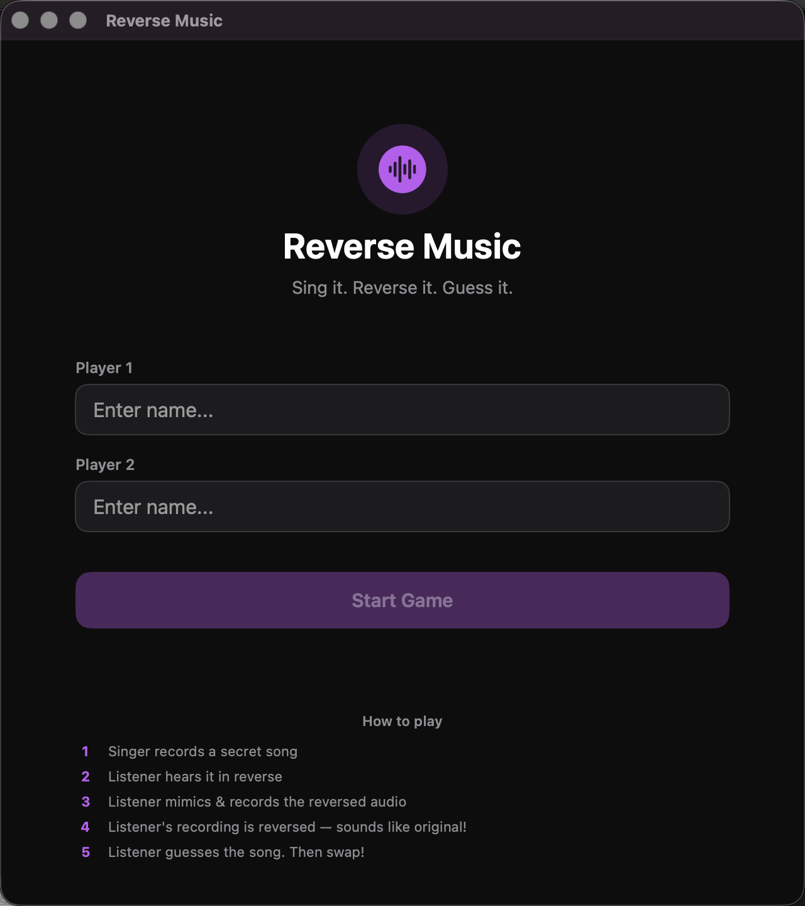

# Reverse Music

A macOS party game built with SwiftUI. One player records themselves singing a line; the app plays it back reversed, and they have to sing along to the reversed audio. Their attempt gets reversed again — if it lines up close to the original, they win the round.

## How to play

1. Singer records a secret song
2. Listener hears it in reverse
3. Listener mimics & records the reversed audio
4. Listener's recording is reversed — sounds like the original!
5. Listener guesses the song, then the two players swap roles

## Tech stack

- Swift, SwiftUI, Swift Package Manager (macOS 13+)
- AVFoundation (`AVAudioRecorder`, `AVAudioPlayer`, `AVAudioPCMBuffer`) for recording, playback, and raw audio manipulation

## What I built

The core mechanic is manipulating raw PCM audio buffers directly: `AudioManager.reverseAudio` reads a recording into an `AVAudioPCMBuffer`, walks the float channel data with a two-pointer swap (mirroring the buffer in place per channel) to reverse it sample-by-sample, then writes it back out as a new audio file — this is lower-level than just using a media framework's built-in "play backwards" flag, since the round-trip (reverse → play → record the listener's attempt → reverse that too) needs a real reversed audio *file* to play back, not just reversed playback.

The game flow itself is a small state machine (`GamePhase`: setup → round intro → singer recording → listener turn → reveal → guess → round complete) driving two players through alternating singer/listener roles across rounds.

## Setup / run

```bash
swift build
swift run
```

Requires microphone permission (macOS will prompt on first recording).

## Screenshots


